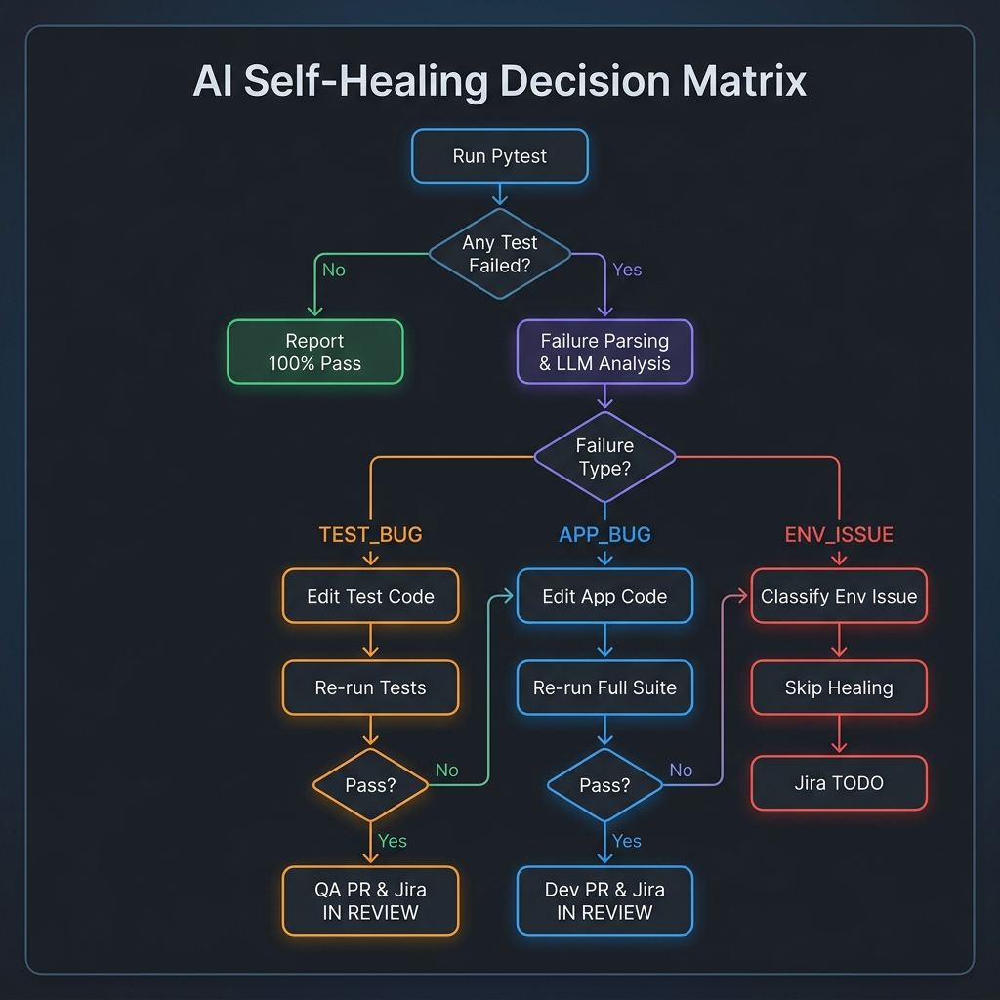
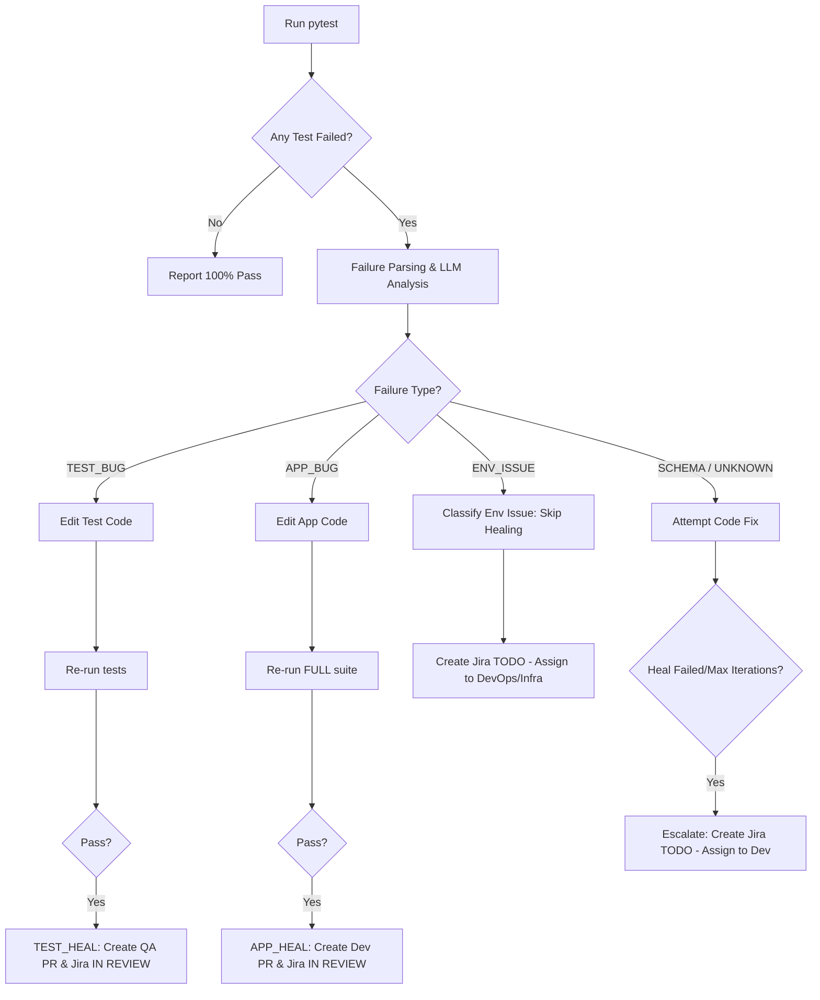

# 📋 RegressionAI Demo: Complete Presentation & Architecture Guide

This guide provides a detailed breakdown of the application architecture, test suite, and the 9 demo scenarios. Use this guide to explain the self-healing and analysis capabilities of the RegressionAI pipeline to stakeholders.

---

## 🏗️ 1. The Application under Test (Dev Repository)
The application is a **Production-Grade Task & Project Management API** built with modern web technologies:
* **Framework**: FastAPI (Asynchronous Python backend).
* **Database**: SQLite/PostgreSQL with SQLAlchemy 2.0 Async ORM.
* **Validation**: Pydantic v2 schemas for strict request/response validation.
* **Core Business Logic Features**:
  1. **User Accounts**: Creating users with unique email validation guards.
  2. **Projects**: Grouping tasks under projects with owner-level access.
  3. **Task & Subtask Workflows**: Tasks have statuses (`todo`, `in_progress`, `done`, `cancelled`) and validation gates (e.g., blocking modification of subtasks if the parent task is completed).
  4. **Pagination**: Efficient skip/limit queries to fetch tasks and projects.

---

## 🧪 2. The Test Framework (QA Repository)
A clean, industry-standard test suite built using **pytest** and divided into:
1. **Unit Tests (`tests/unit/`)**: Test model schemas, enum constraints, and data validations.
2. **Integration Tests (`tests/integration/`)**: Spin up a mock DB session to test endpoint routing, headers, conflict statuses (e.g., `409 Conflict`), and payload validations.

---

## 🛠️ 3. The 9 Demo Scenarios Breakdown

Here is exactly what breaks, why it fails, how the AI heals it, and the resulting outputs (Jira tickets, PRs) for each scenario:

### 🟢 Demo 01: Baseline Green (No failures)
* **What breaks**: Nothing.
* **Test Outcome**: 100% Pass.
* **AI Action**: Scans test execution, confirms everything is green, and completes immediately.
* **Result**: No Jira tickets, no branches, no Pull Requests.

### 🟡 Demo 02: TEST HEAL — Test Assertion Bugs (QA Issue)
* **What breaks**: 
  1. `TC-030` (in `tests/unit/test_task_crud.py`): Test asserts status enum is `"in-progress"` instead of the correct value `"in_progress"`.
  2. `TC-037` (in `tests/unit/test_user_model.py`): Test asserts user name length must be `> 100` instead of `> 0`.
* **AI Action**: Detects that the app behaves correctly but the tests have incorrect assertions.
* **Healing Type**: `TEST_HEAL`.
* **Result**: Creates a **Jira ticket** marked as **IN REVIEW** and opens a **Pull Request (QA)** modifying the test code.

### 🔵 Demo 03: APP HEAL — Inverted Email Guard Logic (Dev Issue)
* **What breaks**: 
  * `TC-012` fails because `app/routers/users.py` has an inverted condition checking if a user exists:
    ```python
    if not existing:  # Instead of: if existing:
        raise HTTPException(status_code=409, detail="Email already registered")
    ```
* **AI Action**: Identifies the logic inversion in the application router. 
* **Healing Type**: `APP_HEAL`.
* **Result**: Rewrites the condition back to `if existing:`, runs the full suite to verify no regressions, creates a **Jira ticket (IN REVIEW)**, and opens a **Pull Request (Dev)**.

### 🔵 Demo 04: APP HEAL — CRUD Pagination Offset Bug (Dev Issue)
* **What breaks**:
  * `TC-005` & `TC-009` fail because `app/crud.py` uses the `limit` parameter as the offset value in pagination:
    ```python
    query.offset(limit).limit(limit)  # Instead of: query.offset(skip).limit(limit)
    ```
* **AI Action**: pinpoints database query error and reverts it back to `offset(skip)`.
* **Healing Type**: `APP_HEAL`.
* **Result**: Resolves issue, verifies full suite passes, creates a **Jira ticket (IN REVIEW)**, and opens a **Pull Request (Dev)**.

### 🔵 Demo 05: APP HEAL — Business Logic Gate (Dev Issue)
* **What breaks**:
  * `TC-106` fails because a code modification in `app/routers/tasks.py` deletes/bypasses the state check check that blocks modifying subtasks of a completed parent task.
* **AI Action**: Restores the validation gate in the update task logic.
* **Healing Type**: `APP_HEAL`.
* **Result**: Restores code, verifies regression checks pass, creates a **Jira ticket (IN REVIEW)**, and opens a **Pull Request (Dev)**.

### 🟣 Demo 06: MIXED COMBO — Test and App Errors (Best Scenario ⭐)
* **What breaks**: A combination of:
  * Test assertion bugs (from Demo 02)
  * Application router bug (from Demo 03)
  * Application CRUD pagination bug (from Demo 04)
* **AI Action**: Concurrently analyzes failures, detects both QA assertion issues and Dev application bugs in the same test run.
* **Healing Type**: `MIXED`.
* **Result**: Heals both repositories concurrently, creates corresponding **Jira tickets**, and opens **two Pull Requests** (one for Dev and one for QA).

### 🔴 Demo 07: ENV ISSUE — Broken Database Connection (Heal Fail)
* **What breaks**:
  * The environment database connection is intentionally broken (e.g., pointing database URL to an invalid/non-existent endpoint).
* **AI Action**: Classifies the failures as `ENV_ISSUE` (since the database connection is refused/down). AI correctly recognizes that changing code will not resolve the issue.
* **Healing Type**: `NONE` (skips healing to prevent editing code for environmental problems).
* **Result**: Leaves the status as **FAILED**, creates a **Jira ticket (TODO)** flagged as an Environment/Infrastructure blocker for human intervention.

### 🔴 Demo 08: SCHEMA BREAK — DB Schema Mismatch (Heal Fail)
* **What breaks**:
  * `app/models.py` has a column renamed (e.g., `due_date` renamed to `deadline`), causing database queries to crash because migrations have not been applied.
* **AI Action**: AI attempts to solve it by editing code, but database validation/verification fails because SQLite lacks the matching schema. 
* **Healing Type**: `NONE` (escalated).
* **Result**: Logs as **FAILED**, creates a **Jira ticket (TODO)** for developer migration review.

### 🔴 Demo 09: COMBO FAIL — Multiple Unhealed Failures (Heal Fail Combo)
* **What breaks**: A mixture of an environment issue (broken database connection) and schema breaks.
* **AI Action**: Skips healing on env issues and escalates the unhealed schema failure.
* **Healing Type**: `NONE`.
* **Result**: Marks the pipeline run as **FAILED (with remaining failures)**, creates separate **Jira tickets (TODO)**.

---

## 📈 4. The Self-Healing Decision Matrix




