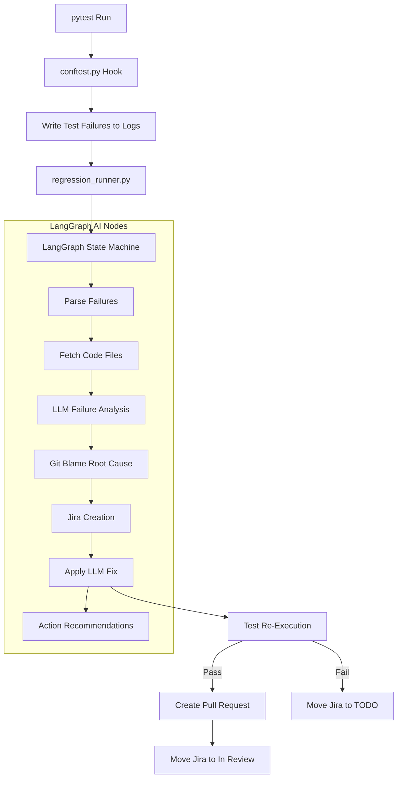

# AI Self-Healing Regression Framework Integration Guide

This guide provides a step-by-step walkthrough for porting the `RegressionAI` self-healing automation framework from this repository into any other Python-based software project.

---

## 🏗️ 1. Architecture Overview

The self-healing framework works by capturing test failures, feeding them into a LangGraph state graph, using an LLM to analyze the source code and classify the failures, applying code fixes, and then syncing the results to GitHub Pull Requests and Jira.



---

## 🚀 2. Step-by-Step Integration

Follow these steps to integrate the self-healing pipeline into your new project.

### Step 1: Copy Core Framework Files
Depending on your repository architecture, copy the framework files to the respective repositories as specified below:

#### Option A: Monorepo Setup (Single Repository)
Copy all files and folders directly to the root of your single project repository:
```text
├── RegressionAI/             # Core LangGraph agent architecture
│   ├── agents/               # 8 Agent nodes (Test runner, failure parse, healing, Jira, etc.)
│   ├── skills/               # Helper utilities and tools
│   ├── graph.py              # LangGraph compilation
│   └── state.py              # Pipeline state definition
├── common_utils/             # Token tracking & utility functions
├── utils/                    # Mailer, Report Excel, and Jira helper scripts
├── config.py                 # Global configurations
├── conftest.py               # Pytest hooks for failure capture & metadata extraction
├── regression_runner.py      # Entry point script that orchestrates the flow
├── pr_body_generator.py      # Script to generate GitHub Pull Request descriptions with Jira links & healing details
└── requirements.txt          # Python dependencies (to merge with existing project requirements)
```

#### Option B: Dual-Repo Setup (Separate App and Test Repositories)
Distribute the files between the two repositories:

1. **In the Application Repository**:
   * `.github/workflows/regression.yml` (placed inside `.github/workflows/` directory)
   * `pr_body_generator.py` (placed at the root of the repository)

2. **In the Test Repository**:
   * `RegressionAI/` (folder at the root)
   * `common_utils/` (folder at the root)
   * `utils/` (folder at the root)
   * `config.py` (at the root)
   * `conftest.py` (at the root or tests directory)
   * `regression_runner.py` (at the root)
   * `requirements.txt` (at the root - merge with existing test repository requirements)

---

### Step 2: Merge and Install Python Dependencies
To avoid overwriting your project's existing dependencies, **do not replace** your current requirements file. Instead, append the framework dependencies to your existing file.

1. **Merge Dependencies**:
   Open the framework's `requirements.txt` and append/merge the dependencies into your project's existing `requirements.txt` (for monorepos, this is your application's requirements; for dual-repos, this is your test repository's `requirements.txt`).
   
   **Key framework dependencies to append:**
   ```text
   langgraph
   langchain-core
   langchain-google-genai
   pytest
   openpyxl
   jira
   click
   rich
   python-dotenv
   pytest-json-report
   requests
   ```

2. **Install Dependencies**:
   Install the merged dependencies in your target environment:
   ```bash
   pip install -r requirements.txt
   ```

### Step 3: Configure Environment Variables
Set up your `.env` file in the root of the environment where tests are run (for Monorepo, at the project root; for Dual-Repo, inside the **Test Repository's** root) with the following keys:

```ini
# LLM Provider Key (Google Gemini / Groq / Anthropic)
GEMINI_API_KEY=your_gemini_api_key_here
GROQ_API_KEY=your_groq_api_key_here

# GitHub Integration
GITHUB_TOKEN=your_github_token_here
TEST_REPO_TOKEN=your_cross_repo_token_here (PAT with 'repo' scope to clone the test repository inside the application repository)

# Jira Integration
JIRA_SERVER=https://your-domain.atlassian.net
JIRA_USERNAME=your-email@domain.com
JIRA_PASSWORD=your_jira_api_token_here
CREATE_JIRA=true # Set to false to disable ticket creation

# TestRail Integration (Optional)
TESTRAIL_ENABLED=true
TESTRAIL_URL=https://your-domain.testrail.io/
TESTRAIL_EMAIL=your-email@domain.com
TESTRAIL_PASSWORD=your_testrail_api_token_or_password_here
TESTRAIL_PROJECT_ID=3
TESTRAIL_SUITE_ID=7
TESTRAIL_RUN_ID=1234 # Optional: Keep empty to create a new run automatically
```

---

## 📝 3. Pytest Formatting Requirements

For the agents to extract metadata (Test Case Name, Steps, and Expected Output) for Jira tickets and reports, your test cases must follow a standardized docstring structure.

### Standard Test Case Docstring Template:
```python
@pytest.mark.testid("TC-101")
def test_user_registration():
    """
    Description: Verifies that a new user can successfully register with valid details.
    Steps:
      1. Send POST request to /users with a unique email and password.
      2. Verify that the response status code is 201 Created.
      3. Verify that the user is persisted in the database.
    Expected Output: User is successfully created and active in the database.
    """
    # Test implementation goes here...
```

*Note: `conftest.py` uses regular expressions to parse `Description:`, `Steps:`, and `Expected Output:` out of the docstring. If these labels are missing, the report and Jira tickets will fallback to generic descriptions.*

---

## ⚙️ 4. Key Configuration Adjustments

To adapt the framework to your project, modify the following files:

### A. Adjust `config.py` (Jira & Board Settings)
Update these lines to point to your target Jira board, project key, and sprint names:
```python
JIRA_SERVER = os.getenv("JIRA_SERVER", "https://your-domain.atlassian.net")
JIRA_USERNAME = os.getenv("JIRA_USERNAME", "your-email@domain.com")
JIRA_PROJECT_KEY = "PROJ"         # Your Jira Project Key
JIRA_BOARD_NAME = "Project Board"  # Your Jira Board Name
JIRA_SPRINT_NAME = "Sprint 1"      # Your current active sprint
```

### B. Adjust `regression_runner.py` (Pytest command)
If you run tests in a different way (e.g. using specific markers or path names), change the default value of the `--test-command` click option in `regression_runner.py`:
```python
@click.option("--test-command", "-c", default="pytest tests/ -v --tb=short --junitxml=logs/test-results.xml")
```

### C. Adjust Agent Paths in `RegressionAI/skills/code_editors.py`
If your application files or test files are in different directories (e.g. `src/` instead of `app/` or `tests/`), update the directory search paths in `node_3_fetch_files.py` and `node_6_self_healing.py` so the LLM can find and edit them.

### D. Self-Healing for Environment Configs (ENV_ISSUE)
The framework is configured to route `ENV_ISSUE` failures through the self-healing sandbox. This ensures that environment-related failures caused by code-based configurations (such as incorrect database connection strings, outdated environment variables, or broken API URLs in test/config files) can be auto-healed like standard test or app bugs.
* If the configuration is healed successfully and passes sandbox testing, it is checked in, and any associated `ENV_ISSUE` warnings are filtered out from the final unresolved list.
* If the failure is a true infrastructure outage (e.g., database service is offline) that cannot be healed by changing configuration code, the healing run will fail verification, and a Jira remediation task ticket will be raised for manual intervention.

### E. Define Project-Specific Prompt Rules (`project_rules.md`)
To keep the framework's core LLM prompts fully generic and reusable across any software project, project-specific rules are separated from the main codebase.
1. Create a `project_rules.md` file in the root of your target project (for Monorepo, at the project root; for Dual-Repo, at the root of the **Application Repository**).
2. Write any project-specific guidelines or constraints (e.g., "Do not delete the 'client' fixture", "Ensure FastAPI routes are decorated with async", database restrictions, etc.) in this file.
3. The self-healing agent will automatically detect and load this file, appending it to the core instructions dynamically. If the file is not present, the agent falls back to pure generic instructions.

### F. Adjust TestRail Settings
If you use TestRail for automated test result tracking:
1. Make sure to define the following parameters in your `.env` file (placed in the **Test Repository** root for Dual-Repo setup, or project root for Monorepo setup):
   ```ini
   TESTRAIL_ENABLED=true
   TESTRAIL_URL=https://your-domain.testrail.io/
   TESTRAIL_EMAIL=your-email@domain.com
   TESTRAIL_PASSWORD=your_api_token_or_password_here
   TESTRAIL_PROJECT_ID=3
   TESTRAIL_SUITE_ID=7
   TESTRAIL_RUN_ID=1234
   ```
2. When copying `.github/workflows/regression.yml` to the **Application Repository**, also update the TestRail environment variables under the `Run AI Regression Analysis Pipeline` step:
   ```yaml
   TESTRAIL_ENABLED: "true"
   TESTRAIL_URL: "https://your-domain.testrail.io/"
   TESTRAIL_EMAIL: "your-email@domain.com"      # Or use ${{ secrets.TESTRAIL_EMAIL }}
   TESTRAIL_PASSWORD: "your-password-or-token"  # Or use ${{ secrets.TESTRAIL_PASSWORD }}
   TESTRAIL_PROJECT_ID: "3"                      # Or use ${{ vars.TESTRAIL_PROJECT_ID }}
   TESTRAIL_SUITE_ID: "7"                        # Or use ${{ vars.TESTRAIL_SUITE_ID }}
   ```
   *Note: For details on mapping pytest markers to TestRail case IDs, refer to the [TestRail Integration Guide](file:///home/mohit/OneDrive/All_Projects/agentic_pipeline/docs/testrail_integration_guide.md).*

---

## 🔗 5. Repository Strategy — Dual-Repo vs Monorepo

The pipeline supports both setups via a **single flag** in the GitHub Actions workflow: `monorepo_mode`.
No code changes are required — just toggle the input when dispatching the workflow.

---

### Mode A: Dual-Repo (Default — Current Setup)

Application code and test code live in **separate GitHub repositories**.

```
agentic_pipeline/            ← App repo (this repo)
└── app/
    ├── crud.py
    ├── models.py
    └── routers/

agentic_pipeline_tests/      ← Test repo (checked out into test_framework/)
└── tests/
    ├── unit/
    └── integration/
```

**Requirements:**
1. Create a GitHub PAT with `repo` scope that has access to both repositories.
2. Add it as `TEST_REPO_TOKEN` secret in the App repository.
3. The workflow automatically checks out the test repo at `test_framework/` using this token.
4. Healed test fixes → PR created in the **test repo** using `TEST_REPO_TOKEN`.
5. Healed app fixes → PR created in the **app repo** using built-in `GITHUB_TOKEN`.

**Workflow dispatch:**
```yaml
monorepo_mode: false          # (default — no change needed)
test_repo: your-org/your-tests-repo   # override if using a different test repo
```

---

### Mode B: Monorepo (Single Repo)

Application code and test code live in the **same repository**.

```
your_project/                ← Single repo
├── app/
│   ├── crud.py
│   ├── models.py
│   └── routers/
└── tests/
    ├── unit/
    └── integration/
```

**Requirements:**
1. No extra tokens needed — the built-in `GITHUB_TOKEN` handles everything.
2. Place `regression_runner.py` and `requirements.txt` at the **repo root**.
3. Test files must be under `tests/` at the root.

**Workflow dispatch:**
```yaml
monorepo_mode: true           # ← this one flag switches the entire pipeline
```

**What changes automatically when `monorepo_mode: true`:**

| Setting | Dual-Repo | Monorepo |
|---------|-----------|----------|
| Checkout | 2 checkouts | 1 checkout |
| Test path | `test_framework/tests/` | `tests/` |
| Runner | `test_framework/regression_runner.py` | `regression_runner.py` |
| Token for test PR | `TEST_REPO_TOKEN` | `GITHUB_TOKEN` (built-in) |
| `requirements.txt` | `test_framework/` | repo root |
| PR `--repo` flag | external test repo | same repo (auto) |

**What stays the same in both modes:**
- LLM failure classification (`TEST_BUG` / `APP_BUG` / `ENV_ISSUE` / `SCHEMA`)
- Auto code healing logic
- Jira ticket creation and Smart Commit transitions
- PR branch naming with Jira IDs
- Excel + HTML report generation
- Jira webhook sync (PR close/reopen)

> **Note:** In monorepo mode, healed app and test fixes still get separate branches
> (`ai-fix-app` and `ai-fix-tests`) and separate PRs within the same repo,
> so each fix can be reviewed independently.

---

## 🔀 6. CI/CD Orchestration (GitHub Actions)

Copy `.github/workflows/regression.yml` from this repository into your project's `.github/workflows/` directory. The workflow is fully parameterized — all options are exposed as `workflow_dispatch` inputs.

### ⚠️ Essential Workflow Customizations (Porting Checklist)

When copying `.github/workflows/regression.yml` to a new project, you **must** update the following values in the YAML file to match your target repository environment:

1. **Update Repository References**:
   - Locate the `test_repo` input option around line 50 and update the `default:` repository string to your own target test repository (e.g., `your-org/your-test-repo`).
   - Locate the `Checkout Test Repository` step around line 88 and update the fallback string `repository: ${{ inputs.test_repo || 'your-org/your-test-repo' }}`.

2. **Update Pytest choices (`test_scope`)**:
   - Modify the choices list under `test_scope` (lines 18-29) to match your new repository's test structure. Keep generic tags like `all`, `unit`, and `integration`, but replace specific test filenames (like `test_project_service.py`) with your own actual test files.
   - Update the corresponding `case` statement in both the **Execute Regression Tests** step and the **Run AI Regression Analysis Pipeline** step to handle your custom choices.

3. **Update TestRail Configuration**:
   - TestRail parameters are defined under the env block in the **Run AI Regression Analysis Pipeline** step.
   - Update `TESTRAIL_EMAIL`, `TESTRAIL_PASSWORD` (or API Token), `TESTRAIL_PROJECT_ID`, and `TESTRAIL_SUITE_ID` to match your own TestRail instance settings. 
   - *Best Practice*: For security, avoid hardcoding credentials in the YAML file. Reference them as secrets or variables (e.g., `${{ secrets.TESTRAIL_EMAIL }}` and `${{ secrets.TESTRAIL_API_TOKEN }}`).

---

### 🔑 GitHub Secrets & Variables Configuration

To run the pipeline successfully, you must add the following configuration settings in your **Application Repository** (the repo where the GitHub Actions workflow file `.github/workflows/regression.yml` is run) under *Settings > Secrets and variables > Actions*:

#### 1. Repository Secrets (Sensitive Data)

Add the following keys under the **Secrets** tab:

| Secret Name | Required When | Description / Purpose |
|-------------|---------------|----------------------|
| `TEST_REPO_TOKEN` | `monorepo_mode: false` (Dual-Repo) | **GitHub Personal Access Token (PAT)** with `repo` scope. This token is required to allow the workflow in your main application repository to clone the external test repository inside itself (under `test_framework/`), and to push healed test fixes back to that repository. |
| `GEMINI_API_KEY` | If using Gemini models | API Key for Google Gemini LLM. |
| `GROQ_API_KEY` | If using Groq models | API Key for Groq (e.g., Llama models). |
| `JIRA_PASSWORD` | If Jira integration is enabled | Your Jira API Token (generated from Atlassian account settings). |
| `TESTRAIL_PASSWORD` | If TestRail integration is enabled | Your TestRail API Token/Password. |

#### 2. Repository Variables (Non-Sensitive Configs)

Add the following keys under the **Variables** tab (or set them as defaults directly in the workflow):

| Variable Name | Default / Example | Purpose |
|---------------|-------------------|---------|
| `DEFAULT_MODEL` | `groq/llama-3.3-70b-versatile` | The main LLM model identifier for failure analysis. |
| `JIRA_PROJECT_KEY` | `SCRUM` | The Jira project code where tickets will be created. |
| `JIRA_SERVER` | `https://your-domain.atlassian.net` | The server URL of your Jira Cloud instance. |
| `JIRA_USERNAME` | `your-email@domain.com` | The email address associated with your Jira account. |
| `TESTRAIL_URL` | `https://your-domain.testrail.io/` | Your TestRail server base URL. |

---

### Workflow Inputs Reference

| Input | Type | Default | Description |
|-------|------|---------|-------------|
| `test_scope` | choice | `all` | Which test folder/file to run |
| `enable_self_healing` | boolean | `true` | Toggle AI healing on/off |
| `create_jira_tickets` | boolean | `true` | Toggle Jira ticket creation |
| `max_healing_iterations` | string | `3` | Max LLM fix attempts per failure |
| `monorepo_mode` | boolean | `false` | **Switch to single-repo mode** |
| `test_repo` | string | `agentic_pipeline_tests` | Override test repo (dual-repo only) |

### Triggering the Pipeline

**Automatic triggers:**
- Push to `main` branch
- Daily at midnight UTC (`schedule`)
- When the test repo pushes to `main` (`repository_dispatch: test-repo-push`)

**Manual trigger (monorepo example):**
```yaml
# Via GitHub UI → Actions → Run workflow
monorepo_mode: true
test_scope: all
create_jira_tickets: true
max_healing_iterations: 3
```

**Manual trigger (dual-repo with custom test repo):**
```yaml
monorepo_mode: false
test_repo: your-org/your-tests-repo
test_scope: integration
create_jira_tickets: true
```

### Pipeline Flow Summary
```
Checkout(s) → Install deps → Run pytest → AI Analysis →
  If APP_HEAL or MIXED  → branch ai-fix-app   → PR in App repo
  If TEST_HEAL or MIXED → branch ai-fix-tests → PR in Test repo (or same repo if monorepo)
  If SCHEMA/UNKNOWN     → Jira TODO ticket only, no PR
```

---

## ✅ 7. Integration Verification Checklist

### Local Verification
- [ ] Run `pytest tests/` locally — confirm `reports/test_results.json` and `reports/raw_output.txt` are generated.
- [ ] Manually break a test assertion and run:
  ```bash
  python regression_runner.py --ci-mode --create-jira false
  ```
- [ ] Check `reports/` for:
  - `ai_summary.json` — contains `healing_type`, classified failures, and Jira IDs.
  - An HTML report showing healed vs unhealed breakdown.
  - An Excel file with failure details and PR/Jira links.
- [ ] Verify the broken file was automatically repaired on disk.

### CI/CD Verification (Dual-Repo)
- [ ] `TEST_REPO_TOKEN` secret is set in the App repo with `repo` scope.
- [ ] Push a broken test to `main` — confirm the workflow runs both checkout steps.
- [ ] After a `TEST_HEAL`, confirm a PR is created in the **test repository**.
- [ ] After an `APP_HEAL`, confirm a PR is created in the **app repository**.
- [ ] Jira tickets appear under the correct project key and transition to `IN REVIEW` after healing.

### CI/CD Verification (Monorepo)
- [ ] `monorepo_mode: true` dispatched — confirm only **one** checkout step runs.
- [ ] `TEST_REPO_TOKEN` is **not** required — pipeline uses built-in `GITHUB_TOKEN` only.
- [ ] After a `TEST_HEAL`, confirm a PR appears in the **same repo** on branch `ai-fix-tests`.
- [ ] After a `MIXED`, confirm **two separate PRs** in the same repo (`ai-fix-app` + `ai-fix-tests`).

### Failure Classification Spot-Check
| Break introduced | Expected `healing_type` | Expected output |
|-----------------|------------------------|-----------------|
| Wrong test assertion value | `TEST_HEAL` | PR on tests branch |
| Inverted `if` in app router | `APP_HEAL` | PR on app branch |
| Wrong DB URL in test config | `TEST_HEAL` | PR on tests branch |
| Renamed DB column (no migration) | `NONE` | Jira TODO only |
| Both assertion + router bug | `MIXED` | 2 PRs created |
