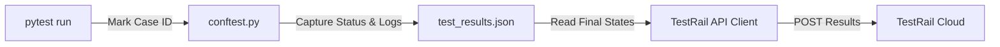

# 📊 TestRail Integration Guide: RegressionAI Pipeline

Integrating **TestRail** (a leading web-based test case management tool) into the RegressionAI framework allows you to track automated test run results, monitor self-healing success, and keep your QA metrics fully synchronized.

---

## 🔑 1. TestRail Basics for Automation

In TestRail, automated testing relies on three main concepts:
1. **Case ID (`CXXXX`)**: The unique identifier of a test case in your TestRail test suite (e.g., `C12345`).
2. **Test Run (`RXXXX`)**: An execution instance containing a set of test cases (e.g., `R4567`).
3. **Test Results**: The outcome (Pass, Fail, Blocked, Retest) along with comments/errors sent to TestRail to update a specific test run.

### Authentication
TestRail uses standard **HTTP Basic Authentication** via its REST API:
* **Username**: Your TestRail login email (e.g., `qa-automation@company.com`).
* **API Token**: Generated in TestRail under *My Settings > API Keys*.

---

## 🛠️ 2. Step-by-Step Integration Plan for RegressionAI

Here is how we integrate TestRail into our LangGraph-based self-healing workflow:



### Step 1: Map pytest Cases to TestRail IDs
Replace or add a custom pytest marker `@pytest.mark.testrail("CXXXX")` to your test cases in `tests/`:

```python
import pytest

@pytest.mark.testid("TC-030")
@pytest.mark.testrail("C98765")  # Map to TestRail case C98765
def test_task_status_workflow():
    """
    Description: Verifies task status updates.
    """
    assert True
```

---

### Step 2: Implement the TestRail API Client
Create a new utility file `utils/report_utils/testrail_client.py` to handle all API communications with TestRail:

```python
# utils/report_utils/testrail_client.py
import os
import requests
from requests.auth import HTTPBasicAuth
import logging

logger = logging.getLogger("RegressionAI.TestRail")

class TestRailClient:
    def __init__(self):
        self.server_url = os.getenv("TESTRAIL_URL", "https://your-domain.testrail.io").rstrip("/")
        self.username = os.getenv("TESTRAIL_USERNAME")
        self.api_token = os.getenv("TESTRAIL_API_TOKEN")
        self.run_id = os.getenv("TESTRAIL_RUN_ID")  # The active Test Run ID (e.g., "1234")
        self.enabled = os.getenv("TESTRAIL_ENABLED", "false").lower() == "true"
        
        self.auth = HTTPBasicAuth(self.username, self.api_token) if self.username and self.api_token else None

    def post_result(self, case_id: str, status_id: int, comment: str, elapsed: str = "1s"):
        """
        Status IDs in TestRail:
          1: Passed
          2: Blocked
          3: Untested
          4: Retest
          5: Failed
        """
        if not self.enabled or not self.auth or not self.run_id:
            logger.info("TestRail integration disabled or credentials missing.")
            return None

        # Clean Case ID (e.g., C98765 -> 98765)
        clean_case_id = case_id.strip().upper().replace("C", "")
        url = f"{self.server_url}/index.php?/api/v2/add_result_for_case/{self.run_id}/{clean_case_id}"
        
        payload = {
            "status_id": status_id,
            "comment": comment,
            "elapsed": elapsed
        }
        
        headers = {"Content-Type": "application/json"}
        
        try:
            resp = requests.post(url, json=payload, auth=self.auth, headers=headers)
            if resp.status_code == 200:
                logger.info(f"Successfully posted result to TestRail for Case C{clean_case_id}")
                return resp.json()
            else:
                logger.error(f"Failed to post to TestRail: {resp.status_code} - {resp.text}")
        except Exception as e:
            logger.error(f"Error communicating with TestRail: {e}")
        return None
```

---

### Step 3: Capture TestRail IDs in `conftest.py`
Modify `conftest.py` (specifically in the `pytest_runtest_makereport` hook) to extract the TestRail marker and record it into the metadata dictionary along with the execution results:

```python
# Inside conftest.py
def pytest_runtest_makereport(item, call):
    # Existing testid extraction logic...
    testrail_marker = item.get_closest_marker("testrail")
    testrail_id = testrail_marker.args[0] if testrail_marker else None
    
    # Store testrail_id in report.sections or metadata dictionary 
    # to make sure it persists into the final JSON output.
```

---

### Step 4: Post Results Post-Healing in `regression_runner.py`
Once the self-healing loop completes and the final run state is written to the JSON report, read the final execution states (including healed statuses) and upload them to TestRail:

```python
# utils/report_utils/testrail_sync.py
import json
from utils.report_utils.testrail_client import TestRailClient

def sync_results_to_testrail(json_report_path: str):
    with open(json_report_path, "r") as f:
        report_data = json.load(f)
        
    client = TestRailClient()
    if not client.enabled:
        return

    results = report_data.get("results", [])
    for result in results:
        testrail_id = result.get("testrail_id")  # Extracted from conftest metadata
        if not testrail_id:
            continue
            
        status = result.get("status")  # "passed", "failed", "healed"
        elapsed = f"{int(result.get('duration_seconds', 1))}s"
        
        if status in ["passed", "healed"]:
            status_id = 1  # Passed
            comment = f"Test passed. Status: {status.upper()}"
            if status == "healed":
                comment += f"\nAuto-healed by LLM. Fix applied: {result.get('applied_fix')}"
        else:
            status_id = 5  # Failed
            comment = f"Test failed.\nError: {result.get('error')}"
            
        client.post_result(testrail_id, status_id, comment, elapsed)
```

---

## ⚙️ 3. Environment Variable Configuration

Add the following variables to your `.env` file:
```ini
TESTRAIL_ENABLED=true
TESTRAIL_URL=https://your-domain.testrail.io
TESTRAIL_USERNAME=qa-automation@company.com
TESTRAIL_API_TOKEN=your_testrail_api_token_here
TESTRAIL_RUN_ID=4567  # The ID of the test run to update
```
